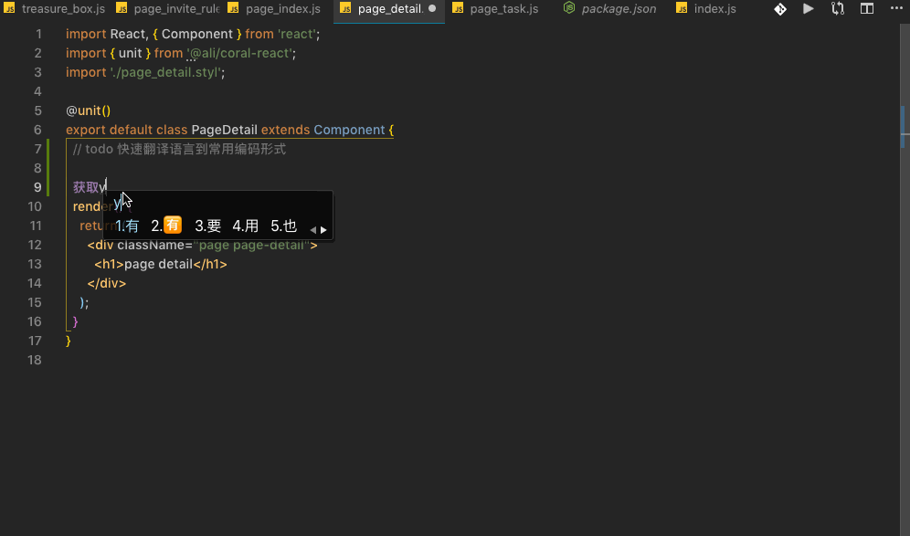
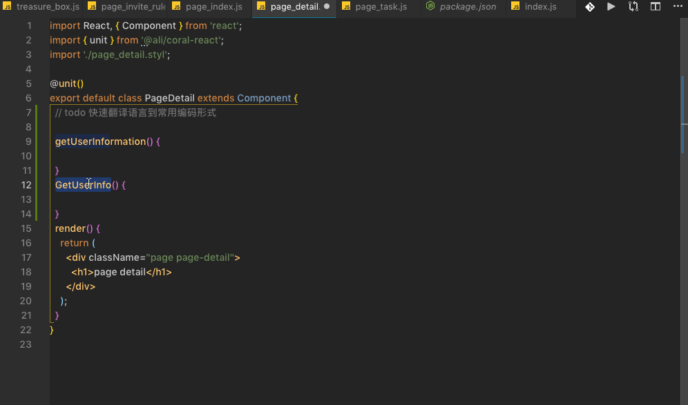
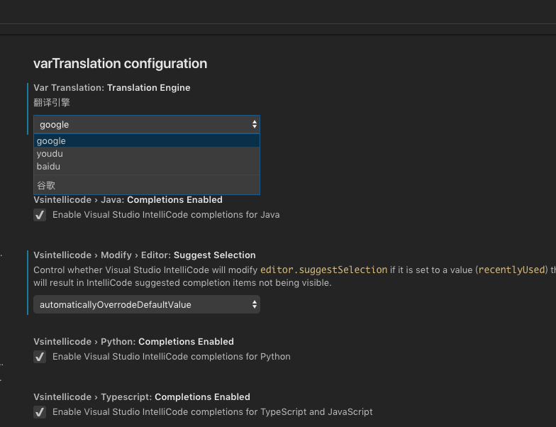

# translate-var README

使用Google Translate API翻译语言到英文,并且转换成常见的编码形式(驼峰 常量等)

## 快捷键 
- key: "Alt+shift+t"
- mac": "cmd+shift+t"
  
## 功能
1. 选中翻译成常用的变量命名方式 
   

2. 直接转换英文(跳过翻译)到常用变量命名方式
   
    
3. 配置常用的引擎翻译引擎(默认谷歌)
   

