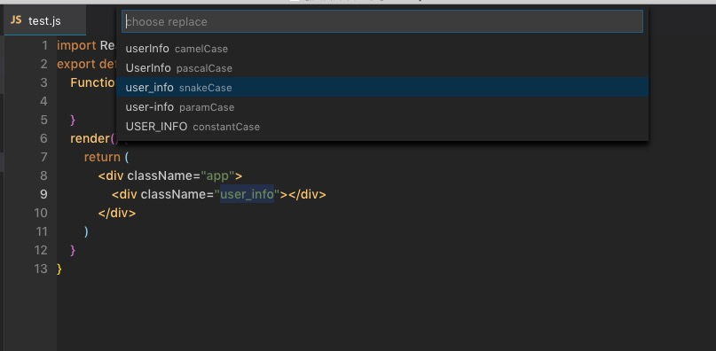

# translate-var README

使用Google Translate API翻译语言到英文,并且转换成常见的编码形式(驼峰 常量等)

## 功能
1. 选中翻译成常用的变量命名方式 默认快捷键:"key": "Alt+shift+t",mac": "cmd+shift+t"

1. 直接转换改变英文单词命名格式

    
## Release Notes
没测试 刚弄好 先将就着用吧

