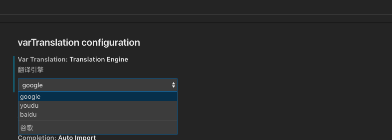

# [translate-var](https://marketplace.visualstudio.com/items?itemName=svenzhao.var-translation)

纠结怎么取变量? 中文一键翻译转换成常用大小驼峰等格式

Automatically translate words into English variable name

# Keybindings  
    win: "Alt+shift+t" 
    mac": "cmd+shift+t"
 
# Selected text translation(选词翻译)

# TranslationEngine default Google(翻译引擎 默认谷歌中国)

