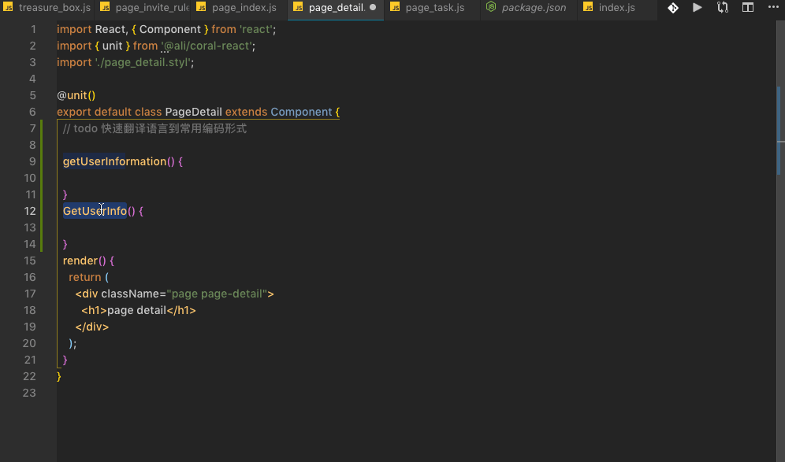

# [驼峰翻译助手 Var Translation](https://marketplace.visualstudio.com/items?itemName=svenzhao.var-translation)

> 选中文本，一键翻译并转换为 camelCase、PascalCase、snake_case 等多种命名格式。支持 8 种翻译引擎，多语言互译。



## ✨ 功能特性

- **智能翻译**：选中中文自动翻译为英文变量名，选中英文变量名翻译为中文释义
- **11 种命名格式**：camelCase、PascalCase、snake_case、CONSTANT_CASE、param-case、Header-Case、dot.case、path/case、Capital Case、no case
- **8 种翻译引擎**：Copilot、ChatGPT、Google、Bing、DeepLX、百度、腾讯、LibreTranslate
- **多语言支持**：不仅限于中英互译，支持日文、韩文、法文、德文等多种目标语言
- **引导式配置**：通过命令面板快速配置引擎，自动测试连通性
- **多行选择**：支持同时翻译多个选中的文本
- **右键菜单**：在编辑器右键菜单中快速访问所有转换命令

## ⌨️ 快捷键

| 平台 | 快捷键 |
|------|--------|
| **macOS** | `Cmd + Shift + T` |
| **Windows / Linux** | `Alt + Shift + T` |

## 🔧 翻译引擎

| 引擎 | 需要 Key | 说明 |
|------|----------|------|
| **⭐ Copilot** | 否 | 零配置，需安装 GitHub Copilot 扩展 |
| **⭐ ChatGPT** | 是 | OpenAI / 兼容 API，支持自定义模型和 Base URL |
| **Google** | 否 | 免费，无需配置 |
| **Bing** | 是 | Azure Translator，每月 200 万字符免费额度 |
| **DeepLX** | 否 | DeepL 免费代理，需自建服务 |
| **百度翻译** | 是 | [申请 API Key](https://hcfy.app/docs/services/baidu-api) |
| **腾讯翻译君** | 是 | [申请 API Key](https://hcfy.app/docs/services/qq-api) |
| **LibreTranslate** | 否 | 开源自建翻译服务 |

### 快速配置

打开命令面板（`Cmd/Ctrl + Shift + P`），输入 **"配置翻译引擎"**，按引导完成配置并自动测试连通性。


## 📋 命名格式

| 命令 | 输入示例 | 输出示例 |
|------|----------|----------|
| camelCase | 用户名称 | `userName` |
| PascalCase | 用户名称 | `UserName` |
| snake_case | 用户名称 | `user_name` |
| CONSTANT_CASE | 用户名称 | `USER_NAME` |
| param-case | 用户名称 | `user-name` |
| Header-Case | 用户名称 | `User-Name` |
| dot.case | 用户名称 | `user.name` |
| path/case | 用户名称 | `user/name` |
| Capital Case | 用户名称 | `User Name` |
| no case | 用户名称 | `user name` |

也可以通过右键菜单或命令面板直接选择指定格式：


每种格式都可以单独设置快捷键：


## 🐳 自建 LibreTranslate

如果你想使用完全私有的翻译服务，可以通过 Docker 快速部署 LibreTranslate：

```yaml
version: '3.9'
services:
  libretranslate:
    command: '--load-only zh,en'
    image: libretranslate/libretranslate
    restart: unless-stopped
    ports:
      - '5000:5000'
    volumes:
      - './lt-local:/home/libretranslate/.local'
```

部署后在插件设置中将 LibreTranslate API 地址指向 `http://localhost:5000/translate` 即可。

## 🤝 致谢

感谢以下贡献者：

- **ChatGPT 引擎** — [@iarjian](https://github.com/iarjian)
- **LibreTranslate 引擎** — [@kongxiangyiren](https://github.com/kongxiangyiren)
- **DeepLX 引擎** — [@没用的小废鼠](https://github.com)

## 📝 反馈

遇到问题或有建议？欢迎 [提交 Issue](https://github.com/SvenZhao/var-translation/issues)。

## 📄 License

[MIT](LICENSE)
